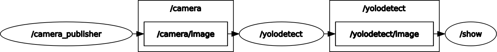

# Object Detection with ROS2 and YOLO

A real-time object detection system built with ROS2 Jazzy and YOLO, designed for camera-based object detection and visualization.

## ✨ Key Highlights

- 🚀 **High-Performance C++ Implementation** - Core detection and processing nodes written in C++ for optimal performance
- 📟 **Edge Device Ready** - Optimized for Raspberry Pi and ARM-based single-board computers
- 🐳 **Dev Container Included** - Ready-to-use VS Code development environment with all dependencies pre-configured
- ⚡ **Real-Time Processing** - Low-latency object detection pipeline for live video streams
- 🔧 **Modular Architecture** - Clean separation of concerns with ROS2 nodes for camera, detection, and visualization

## 📋 Overview

This project implements a modular object detection pipeline using ROS2, featuring:
- **Real-time camera capture** from video sources
- **YOLO-based object detection** for identifying and classifying objects
- **Live visualization** of detection results
- **Custom ROS2 messages** for YOLO detection data
- **Modular architecture** with separate nodes for camera, detection, and visualization
- **High-performance C++ implementation** for detection and processing nodes
- **Edge device ready** - optimized for deployment on Raspberry Pi and similar platforms
- **VS Code Dev Container** - ready-to-use development environment with all dependencies pre-configured

## 🎥 Detection Results

Watch the system in action:

[]

*Click the image above to view the detection demo video*

## 🏗️ Architecture

The system consists of four main ROS2 packages working together in a pipeline:



### Package Structure

```
📦 Object Detection System
├── 📦 pkg_camera          # Camera capture and image publishing
├── 📦 pkg_yolodetect      # YOLO-based object detection
├── 📦 pkg_show            # Visualization of detection results
├── 📦 yolo_msgs           # Custom message definitions
└── 📦 objectdetection     # Launch configuration
```

### Nodes and Topics

- **pkg_camera**: Captures video frames and publishes them to `camera/image` topic
- **pkg_yolodetect**: Subscribes to `camera/image`, performs YOLO detection, and publishes annotated images to `yolodetect/image`
- **pkg_show**: Subscribes to `yolodetect/image` and displays the results in real-time
- **yolo_msgs**: Defines custom message types for YOLO detection data

### 🚀 High-Performance C++ Implementation

The core detection and processing packages (`pkg_camera`, `pkg_yolodetect`, and `pkg_show`) are implemented in **C++** for maximum performance and efficiency. This design choice provides:

- **Low latency** - Minimal processing overhead for real-time detection
- **Efficient memory management** - Direct control over image processing pipelines
- **Edge device compatibility** - Optimized for resource-constrained environments
- **High throughput** - Capable of processing high-resolution video streams

### 📟 Edge Device Support

This system is designed to run on **edge devices** including:
- **Raspberry Pi 4/5** - Tested and optimized for ARM architecture
- **NVIDIA Jetson** series - GPU-accelerated inference support
- **Other ARM-based SBCs** - Portable and efficient deployment

The lightweight C++ implementation ensures smooth operation even on devices with limited computational resources.

## 🚀 Getting Started

### 🐳 Dev Container Setup (Recommended)

The easiest way to get started is using the **VS Code Dev Container**, which provides a fully configured development environment:

1. **Prerequisites**
   - [Visual Studio Code](https://code.visualstudio.com/)
   - [Docker](https://www.docker.com/get-started)
   - [Dev Containers extension](https://marketplace.visualstudio.com/items?itemName=ms-vscode-remote.remote-containers)

2. **Open in Dev Container**
   - Open the project folder in VS Code
   - When prompted, click "Reopen in Container"
   - Or use Command Palette (`Ctrl+Shift+P`) → "Dev Containers: Reopen in Container"

3. **Start Developing**
   - All dependencies (ROS2 Jazzy, OpenCV, build tools) are pre-installed
   - The workspace is ready to build and run immediately

### Manual Setup

If you prefer to set up the environment manually:

### Prerequisites

- ROS2 Jazzy
- Ubuntu 24.04 LTS (or compatible)
- OpenCV with Python/C++ bindings
- YOLO model files
- Colcon build system

### Build Process

1. **Clone the repository**
   ```bash
   cd /workspace
   ```

2. **Source ROS2 environment**
   ```bash
   source /opt/ros/jazzy/setup.zsh
   ```

3. **Build all packages**
   ```bash
   colcon build --symlink-install --event-handlers console_cohesion+ --cmake-args -DCMAKE_BUILD_TYPE=Debug
   ```

4. **Source the workspace**
   ```bash
   source install/setup.zsh
   ```

### Quick Build

You can also use the pre-configured VS Code task:
- Press `Ctrl+Shift+P`
- Select `Tasks: Run Task`
- Choose `colcon: build`

Or run from terminal:
```bash
colcon build && source install/setup.zsh
```

## 🎮 Running the System

### Launch All Nodes

To start the complete object detection pipeline:

```bash
source /opt/ros/jazzy/setup.zsh
source install/setup.zsh
ros2 launch objectdetection objectdetection.launch.py
```

### Using VS Code Task

Alternatively, use the pre-configured launch task:
- Press `Ctrl+Shift+P`
- Select `Tasks: Run Task`
- Choose `ros: launch`

### Launch Individual Nodes

You can also launch nodes separately for debugging:

```bash
# Launch camera node
ros2 launch pkg_camera camera.launch.py

# Launch YOLO detection node
ros2 launch pkg_yolodetect yolodetect.launch.py

# Launch visualization node
ros2 launch pkg_show show.launch.py
```

## 🔧 Configuration

### Launch Arguments

The main launch file supports configurable topic names:

```bash
ros2 launch objectdetection objectdetection.launch.py \
  camera_output_topic:=camera/image \
  yolodetect_input_topic:=camera/image \
  yolodetect_output_topic:=yolodetect/image \
  show_input_topic:=yolodetect/image
```

## 🧹 Cleaning the Workspace

To clean build artifacts:

```bash
cd /workspace
rm -rf build/ install/ log/
```

Or use the VS Code task `colcon: clean`.

## 📦 Dependencies

### Core Implementation
- **C++ (Primary)** - High-performance nodes for camera, detection, and visualization
- `rclcpp` - ROS2 C++ client library
- `sensor_msgs` - Standard sensor message types
- `cv_bridge` - OpenCV-ROS2 bridge for C++ image processing
- `launch_ros` - ROS2 launch system

### Python Dependencies
See `docker/requirements.txt` for Python package dependencies.

### System Dependencies
See `docker/dependencies.list` for system-level dependencies.

## 🐳 Docker & Dev Container Support

### VS Code Dev Container (Recommended)

The project includes a complete **Dev Container** configuration that provides:
- ✅ ROS2 Jazzy pre-installed and configured
- ✅ All C++ build tools and dependencies
- ✅ OpenCV with C++ bindings
- ✅ Pre-configured VS Code tasks for building and running
- ✅ Ubuntu 24.04 LTS base environment

Simply open the project in VS Code with the Dev Containers extension and you're ready to develop!

### Standalone Docker

For containerized deployment without VS Code:

```bash
# Build Docker image
docker build -f docker/Dockerfile -t objectdetection .

# Run container
docker run -it --rm objectdetection
```

## 📁 Project Structure

```
/workspace
├── src/                    # Source packages
│   ├── objectdetection/    # Launch configurations
│   ├── pkg_camera/         # Camera node (C++)
│   ├── pkg_yolodetect/     # YOLO detection node (C++)
│   ├── pkg_show/           # Visualization node (C++)
│   └── yolo_msgs/          # Custom message definitions
├── resource/               # Media resources
│   ├── detection.mp4       # Demo video
│   ├── rosgraph.png        # Architecture diagram
│   └── traffic.mp4         # Additional demo
└── docker/                 # Docker configuration
```

## 📝 License

MIT License

Copyright (c) 2025 Steffen Stautmeister

Permission is hereby granted, free of charge, to any person obtaining a copy
of this software and associated documentation files (the "Software"), to deal
in the Software without restriction, including without limitation the rights
to use, copy, modify, merge, publish, distribute, sublicense, and/or sell
copies of the Software, and to permit persons to whom the Software is
furnished to do so, subject to the following conditions:

The above copyright notice and this permission notice shall be included in all
copies or substantial portions of the Software.

THE SOFTWARE IS PROVIDED "AS IS", WITHOUT WARRANTY OF ANY KIND, EXPRESS OR
IMPLIED, INCLUDING BUT NOT LIMITED TO THE WARRANTIES OF MERCHANTABILITY,
FITNESS FOR A PARTICULAR PURPOSE AND NONINFRINGEMENT. IN NO EVENT SHALL THE
AUTHORS OR COPYRIGHT HOLDERS BE LIABLE FOR ANY CLAIM, DAMAGES OR OTHER
LIABILITY, WHETHER IN AN ACTION OF CONTRACT, TORT OR OTHERWISE, ARISING FROM,
OUT OF OR IN CONNECTION WITH THE SOFTWARE OR THE USE OR OTHER DEALINGS IN THE
SOFTWARE.

## 🤝 Contributing

Contributions are welcome! Please feel free to submit issues or pull requests.

## 📚 Additional Resources

- [ROS2 Jazzy Documentation](https://docs.ros.org/en/jazzy/)
- [Colcon Documentation](https://colcon.readthedocs.io/)
- [YOLO Object Detection](https://github.com/ultralytics/yolov5)
